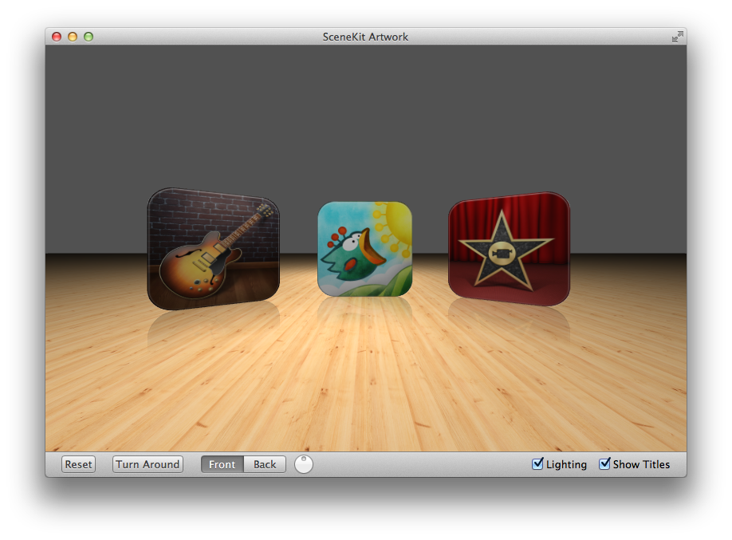

# SceneKitArtwork

A sample code showing various aspects of Scene Kit (3D-rendering Objective-C framework available in OS X 10.8+).

Features:

* Reset: reset the camera position to the initial value.
* Turn around: turn the camera around the artwork boxes.
* Control the camera position with a slider.
* Lighting on/off. While the lighting is enabled, clicking on an artwork box moves a spot on it.
* Display/hide an extruded title on the artwork back side.

*You can control the camera position using your mouse and CMD / ALT keys.*

## Creator

[Benoît Bourdon](https://github.com/benoitsan) ([@benoitsan](https://twitter.com/benoitsan)).

## License

SceneKitArtwork is available under the MIT license. See the LICENSE file for more info.